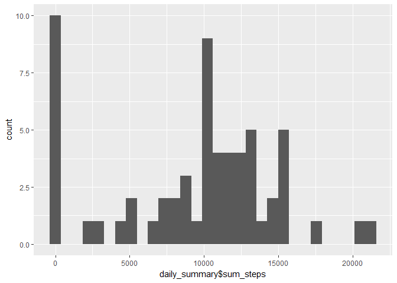

# Reproducible Research: Peer Assessment 1


## Loading and preprocessing the data
Read the data into a dataframe "data"

```r
data <- read.csv(unzip("activity.zip"))
```

## What is mean total number of steps taken per day?

```r
library(dplyr)
```

```
## 
## Attaching package: 'dplyr'
```

```
## The following objects are masked from 'package:stats':
## 
##     filter, lag
```

```
## The following objects are masked from 'package:base':
## 
##     intersect, setdiff, setequal, union
```

```r
# Ignoring the missing values in the dataset.

# (1) Calculate the total number of steps taken per day
daily_summary <- 
    summarize(group_by(data,date),
              sum_steps=sum(steps,na.rm=T)
              )

# (3) Make a histogram of the total number of steps taken each day
library(ggplot2)
qplot(daily_summary$sum_steps)
```

```
## `stat_bin()` using `bins = 30`. Pick better value with `binwidth`.
```

<!-- -->

```r
# (2) Calculate and report the mean and median of the total number of steps taken per day
mean(daily_summary$sum_steps, na.rm=T)
```

```
## [1] 9354.23
```

```r
median(daily_summary$sum_steps, na.rm=T)
```

```
## [1] 10395
```

## What is the average daily activity pattern?

```r
# (1) Make a time series plot (i.e. type = "l") of the 5-minute interval (x-axis) and the average number of steps taken, averaged across all days (y-axis)
interval_summary <- 
    summarize(group_by(data,interval),
              mean_steps=mean(steps,na.rm=T),
              sum_steps=sum(steps,na.rm=T))

qplot(interval,mean_steps,data=interval_summary, geom = "line")
```

<!-- -->

```r
# (2) Which 5-minute interval, on average across all the days in the dataset, contains the maximum number of steps?
interval_summary$interval[which.max(interval_summary$mean_steps)]
```

```
## [1] 835
```


## Imputing missing values

```r
# (1) Calculate and report the total number of missing values in the dataset (i.e. the total number of rows with NAs)
sum(is.na(data$steps))
```

```
## [1] 2304
```

```r
# Devise a strategy for filling in all of the missing values in the dataset. The strategy does not need to be sophisticated. For example, you could use the mean/median for that day, or the mean for that 5-minute interval, etc.
data_copy <-
    data %>% 
    group_by(interval) %>%
    mutate(steps= replace(steps, is.na(steps), mean(steps, na.rm=TRUE)))
# verify
sum(is.na(data_copy$steps))
```

```
## [1] 0
```

```r
# (4) Make a histogram of the total number of steps taken each day and Calculate and report the mean and median total number of steps taken per day. Do these values differ from the estimates from the first part of the assignment? What is the impact of imputing missing data on the estimates of the total daily number of steps?
```


## Are there differences in activity patterns between weekdays and weekends?
